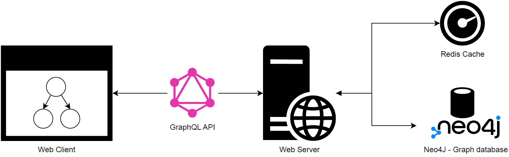

# Dependency visualization - DepVis

DepVis is a Proof-of-Concept tool for visualization of open source dependencies and vulnerabilities using Software Bill of Materials (SBOM) as the input.

This tool was developed as part of Master's thesis "Visualization of Vulnerabilities in Open Source Software Dependencies" by Matej Groman at FI MUNI.

## Contents

- (dir) sample_bom
  - contains sample CycloneDX SBOM files which can be used for DepVis evaluation
- (dir) src/depvis-next
  - contains the DepVis application
- .env.example
  - example environmental variables used for `docker-compose`
- `docker-compose.yml`
  - A Docker Compose file which can be used for local deployment
- `docker-compose-azure.yml`
  - A Docker Compose file which can be used for deplyment into Azure Containers

## Prerequisites

- Docker & Docker Compose
- Node (> v16)

## Deployment

Deployment is realized using three Docker containers. Following Figure presents the DepVis architecture.

- The Web Client and Web Server is running as one container using [Next.js framework](https://nextjs.org/).
- Data are stored in a [Neo4J Database](https://neo4j.com/) running as second container
- A Redis Cache is used by import queue, realized by third container.



To make deployment easier, a `docker-compose.yml` files are used to define complete infrastructure.

### Using Docker locally

- Clone this repository
- Create environment variables file for docker compose - check [example](./.env.example) for supported variables.
  - Minimum required are: `NEO4J_PASSWORD` (8 characters) and `REDIS_PASSWORD`.
  - Optionally you can create environment variables file according to sample file in Next.js app - [example](./src/depvis-next/.env.production.example) and edit `docker-compose.yml` accordingly.
- To build all services use `docker-compose build`
- Start all services using `docker-compose up`
- For more details follow installation steps for Next.js app [here](./src/depvis-next/README.md)

### Using Azure containers

It is also possible to deploy the container stack into Azure. Follow [official guide](https://learn.microsoft.com/en-us/azure/container-instances/tutorial-docker-compose) to:

- Clone this repository
- Create Azure Container Registry
- Login into Azure Container Registry (ACR) using `az acr login --name <acrName>`
- Create environment variables file for docker compose - check [example](./.env.example) for supported variables.
  - Minimum required are: `NEO4J_PASSWORD`, `REDIS_PASSWORD` and `ACR_NAME`.
- Build docker image (in default Docker Context) using [Azure Docker Compose file](./docker-compose-azure.yml) and push image to ACR created earlier

```
> docker-compose -f ./docker-compose-azure.yml build
> docker-compose push
```

- Create new Docker context and switch to it using

```
> docker login azure
> docker context create aci depvis
> docker context use depvis
```

- Publish new container stack in new context using `docker compose up`

- See `docker ps` for details

## Repository content

- [sample_bom](./sample_bom/): Contains sample SBOM files for quick testing purposes
- [src/depvis-next](./src/depvis-next/): Next.js web application
- [docker-compose.yml](./docker-compose.yml): Create containers necessary for proper functionality

```

```
